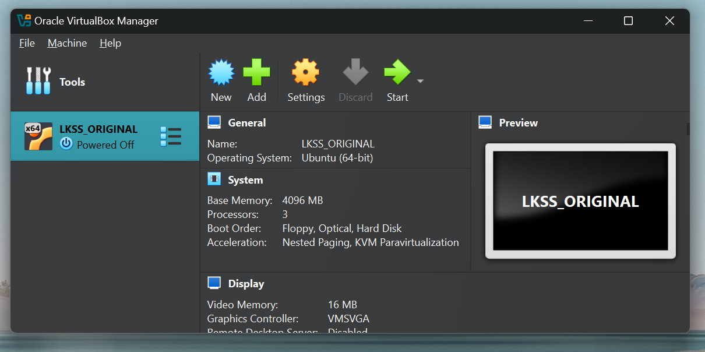
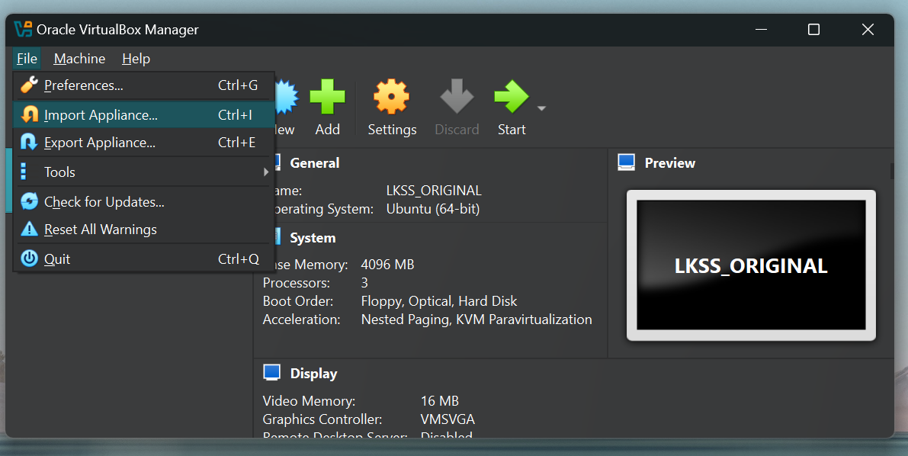
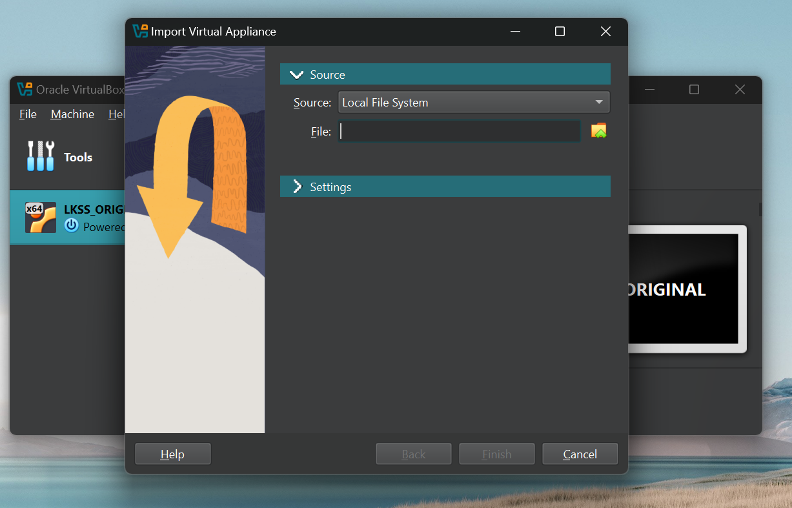
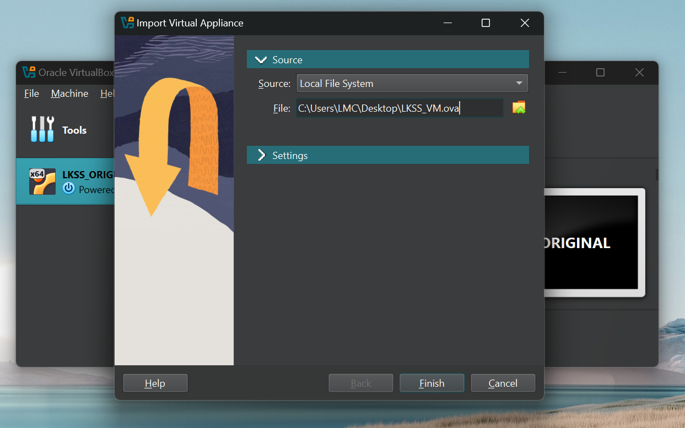
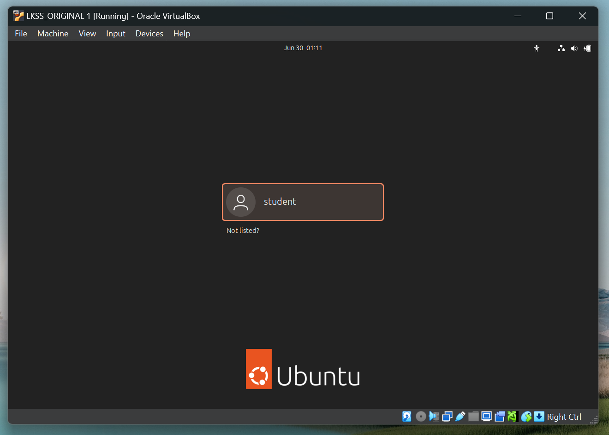

# LKSS 2025 edition infrastructure guide

Hello everyone and welcome to the **Linux Kernel Summer School (LKSS)** 2025
edition! This document shall guide you through the steps required for setting
up the environment required for this year's edition. The setup steps depend on
your host OS so please make sure you follow the appropriate section.

## Setting up the infrastructure for Windows-based systems

Since we are going to be working with the Linux kernel, we'll need a UNIX-based
system in which we can compile the Linux kernel and, generally, do our development.

### Running Linux in a Virtual Machine (VM)

For a Windows-based system, we can run a Linux distribution inside a **Virtual Machine**.
Before setting up the virtual machine, we're going to first have to install a virtual
machine manager (VMM). Some examples of free VMMs include:

1. VirtualBox ([download page](https://www.virtualbox.org/wiki/Downloads))
2. VMWare Workstation Player [^1]

Using any of the VMMs listed above is fine. If you already have one of them installed
then just go with that one :). You're also free to use any other VMM you wish although
this is not really recommended.

Now, after choosing and installing a VMM, it's time to boot our virtual machine!
For this year's edition, we're going to be providing you with a virtual machine, which
has all of the packages and utilities you're going to need. The OVA can be downloaded
from [here](https://drive.google.com/drive/folders/1gfQBi6mHruHgGcdT1p4FkDihwX9Cfx2m)

#### Importing the OVA using VirtualBox

When opening VirtualBox you should be greeted with an interface similar to the
one shown in the figure below (ignore the already existing LKSS\_ORIGINAL!):

To import the OVA you've downloaded in the previous step you'll need to go to
"File > Import Appliance..." as shown below:

You'll be prompted with the following menu:

In the "File" text box, make sure you select the previously downloaded
OVA as shown below:

If you need to change the directory in which VirtuaBox stores machine data
then you'll need to navigate to the "Settings" menu and then scroll down
until you find the "Machine Base Folder" text box.

When you're done, press "Finish" and let VirtualBox do its magic! After the
import operation is over you'll see your virtual machine in the left pane just
like the LKSS\_ORIGINAL from the first image.

To start the VM, you need to select it and then click "Start". If everything goes
well, you should see the Ubuntu login prompt:

Please use the following credentials:

* username: student
* password: student

And with this, we are done!

**Note: you are free to tweak the parameters of the machine (e.g. CPU number, memory, etc.)
as you see fit. You can do so by selecting the machine and then clicking on the "Settings"
button. The machine will have to be powered off for this.**

#### Importing the OVA using VMWare

## Setting up the infrastructure for Linux-based systems

[^1]: This might not be free anymore. In case you don't already have this VMM
or the university doesn't provide free licenses anymore just go with VirtualBox.
